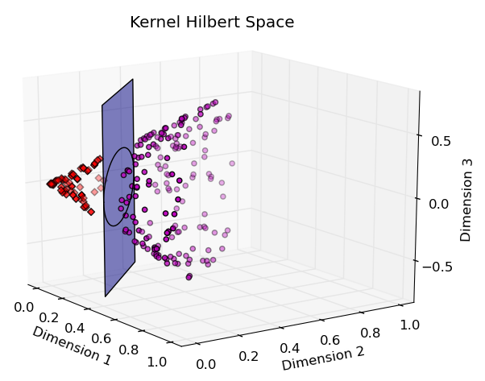
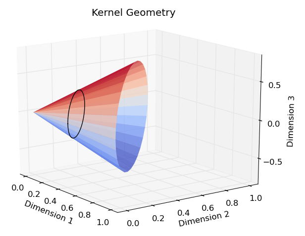

# Machine Learning Kernels

_**MLKernels.jl** is a Julia package that provides a collection of common machine learning
kernels and a set of methods to efficiently compute kernel matrices._

| **Package Status** | **Build Status**  |
|:------------------:|:-----------------:|
 | 

### Documentation

Read the full [documentation](https://trthatcher.github.io/MLKernels.jl/dev).

### Visualization

Through the use of kernel functions, kernel-based methods may operate in a high
(potentially infinite) dimensional implicit feature space without explicitly
mapping data from the original feature space to the new feature space.
Non-linearly separable data may be linearly separable in the transformed space.
For example, the following data set is not linearly separable:

Using a Polynomial Kernel of degree 2, the points are mapped to a 3-dimensional
space where a plane can be used to linearly separate the data:

Explicitly, the Polynomial Kernel of degree 2 maps the data to a cone in
3-dimensional space. The intersecting hyperplane forms a conic section with the
cone:

When translated back to the original feature space, the conic section
corresponds to a circle which can be used to perfectly separate the data:

The above plots were generated using
[PyPlot.jl](https://github.com/stevengj/PyPlot.jl).
