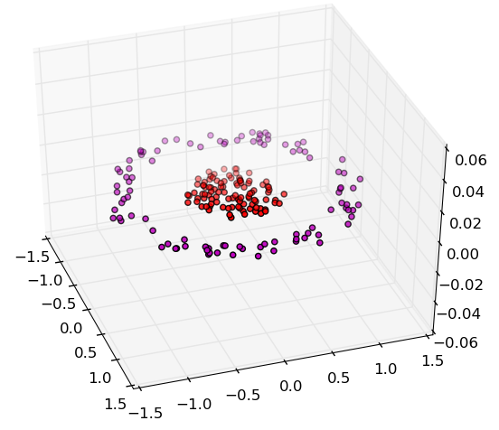
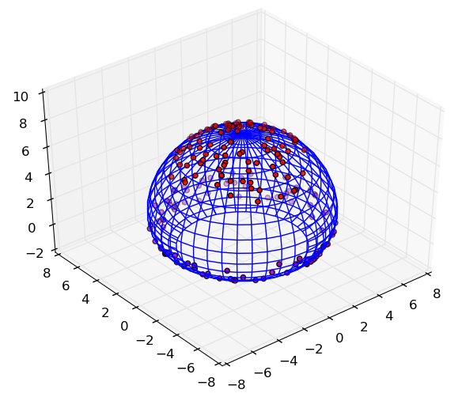

# Machine Learning Kernels

[](http://mlkernels.readthedocs.org/en/latest/?badge=latest)
[](https://travis-ci.org/trthatcher/MLKernels.jl)
[](https://coveralls.io/r/trthatcher/MLKernels.jl)

**MLKernels.jl** is a Julia package for Mercer kernel functions (or the 
covariance functions used in Gaussian processes) that are used in the kernel 
methods of machine learning. This package provides a flexible datatype for 
representing and constructing machine learning kernelsas well as an efficient
set of methods to compute or approximate kernel matrices. The package has no 
dependencies beyond base Julia.






### Getting Started

##### Constructing Kernels

**MLKernels.jl** comes with a number of pre-defined kernel functions. For 
example, one of the most popular kernels is the Gaussian kernel (also known as 
the radial basis kernel or squared exponential covariance function). The code 
documentation may be used to learn more about the parametric forms of kernels 
using the `?` command and searching for the kernel name:

```julia
julia> using MLKernels

help?> GaussianKernel
search: GaussianKernel

  GaussianKernel(α) = exp(-α⋅‖x-y‖²)
```
The Gaussian Kernel has one scaling parameter `α`. We may instantiate the kernel
using:

```julia
julia> GaussianKernel(2.0)
KernelComposition{Float64}(ϕ=Exponential(α=2.0,γ=1.0),κ=SquaredDistance(t=1.0))
```

The `Kernel` data type is parametric - any subtype of `AbstractFloat`, though
only `Float32` and `Float64` are recommended. The default type is `Float64`.

The Gaussian kernel is actually a specific case of a more general class of
kernel. It is composition of scalar function and the squared (Euclidean) 
distance, `SquaredDistanceKernel`, which itself is a kernel. The scalar function
 referenced is referred to as the `ExponentialClass`, a subtype of the 
`CompositionClass` type. Composition classes may be composed with a kernel to 
yield a new kernel using the `∘` operator (shorthand for `KernelComposition`):

```julia
julia> ϕ = ExponentialClass(2.0, 1.0);

julia> κ = SquaredDistanceKernel(1.0);

julia> ψ = ϕ ∘ κ   # use \circ for '∘'
KernelComposition{Float64}(ϕ=Exponential(α=2.0,γ=1.0),κ=SquaredDistance(t=1.0))
```

**MLKernels.jl** implements only symmetric real-valued continuous kernel 
functions (a subset of the kernels studied in the literature). These kernels 
fall into two groups:
 - *Mercer Kernels* (positive definite kernels)
 - *Negative Definite Kernels*

A negative definite kernels is equivalent to the conditionally positive definite
kernels that are often discussed in machine learning literature. A conditionally
positive definite kernel is simply the negation of a negative definite kernel.

Returning to the example, the squared distance kernel is not a Mercer kernel 
although the resulting Gaussian kernel *is* Mercer. Kernels may be inspected 
using the `ismercer` and `isnegdef` functions:

```julia
julia> ismercer(κ)
false

julia> isnegdef(κ)
true

julia> ismercer(ψ)
true

julia> isnegdef(ψ)
false
```

`AdditiveKernel` types are available as **Automatic Relevance Determination** 
(ARD) Kernels. Weights may be applied to each element-wise function applied to
the input vectors. For the scalar product and squared distance kernel, this 
corresponds to a linear scaling of each of the dimensions.

```julia
julia> w = round(rand(5),3);

julia> ARD(κ, w)
ARD{Float64}(κ=SquaredDistance(t=1.0),w=[0.358,0.924,0.034,0.11,0.21])
```

##### Kernel Functions


##### Kernel Operations


 A kernel can be constructed using one of the many predefined kernels. Once a kernel has been constructed, it can be passed to the `kernel` function and used to compute kernel function of two vectors. For example, the simplest base kernel is the scalar (dot) product kernel:

```julia
julia> κ = ScalarProductKernel()
ScalarProductKernel{Float64}()

julia> x,y = (10rand(3),10rand(3))
([4.5167,7.60119,0.692922],[7.46812,0.605204,9.39787])

julia> kernel(κ,x,y)
44.843518824558856

julia> dot(x,y)
44.843518824558856
```

Several other base kernels have been defined. For example, the squared distance kernel is the squared l2 norm:

```julia
julia> κ = SquaredDistanceKernel()
SquaredDistanceKernel{Float64}(t=1.0)

julia> kernel(κ,x,y)
133.43099175980925

julia> dot(x.-y,x.-y)
133.43099175980925
```
A subset of the base kernels, known as Additive Kernels, are also available as Automatic Relevance Determination kernels. If the kernel function consists of a sum of elementwise functions applied to each dimension, then it is amenable to automatic relevance determination. Continuing on with the squared distance kernel:

```julia
julia> SquaredDistanceKernel <: AdditiveKernel
true

julia> w = 10rand(3)
3-element Array{Float64,1}:
 9.29903
 1.24022
 3.21233

julia> ψ = ARD(κ,w)
ARD{Float64}(κ=SquaredDistanceKernel(t=1.0),w=[9.29903,1.24022,3.21233])

julia> kernel(ψ,x,y)
1610.469072503976

julia> dot((x.-y).*w,(x.-y).*w)
1610.4690725039757
```

Base kernels can be extended using composite kernels. These kernels are a function of a base kernel. For example, the Gaussian Kernel (Radial Basis Kernel) may be constructed in the following way:

```julia
julia> ϕ = ExponentialKernel(κ)
ExponentialKernel{Float64}(κ=SquaredDistanceKernel(t=1.0),α=1.0,γ=1.0)

julia> GaussianKernel()
ExponentialKernel{Float64}(κ=SquaredDistanceKernel(t=1.0),α=1.0,γ=1.0)
```

To compute a kernel matrix:

```
julia> X = rand(5,3);

julia> kernelmatrix(ϕ, X)
5x5 Array{Float64,2}:
 1.0       0.710224  0.353483  0.858427  0.704625
 0.710224  1.0       0.743461  0.799072  0.713864
 0.353483  0.743461  1.0       0.584813  0.284877
 0.858427  0.799072  0.584813  1.0       0.526931
 0.704625  0.713864  0.284877  0.526931  1.0     
```

This assumes that each row of X is an observation. If observations are stored as columns, use `'T'` (default is `'N'`) for the first argument:

```julia
julia> kernelmatrix(ϕ, X, 'T')
3x3 Array{Float64,2}:
 1.0       0.617104  0.245039
 0.617104  1.0       0.408998
 0.245039  0.408998  1.0   
```

One key property of kernels is whether or not they are Mercer kernels or negative definite kernels. The functions `ismercer` and `isnegdef` can be used to test whether or not a kernel is Mercer or negative definite:

```julia
julia> ismercer(SquaredDistanceKernel())
false

julia> isnegdef(SquaredDistanceKernel())
true

julia> ismercer(ScalarProductKernel())
true

julia> isnegdef(ScalarProductKernel())
false
```

Note that the definity of a base kernel does not imply anything about the definity of the composite kernel. For example, the Gaussian Kernel is Mercer but the underlying Squared Distance base kernel is negative definite:

```julia
julia> ismercer(GaussianKernel())
true

julia> isnegdef(GaussianKernel())
false
```
