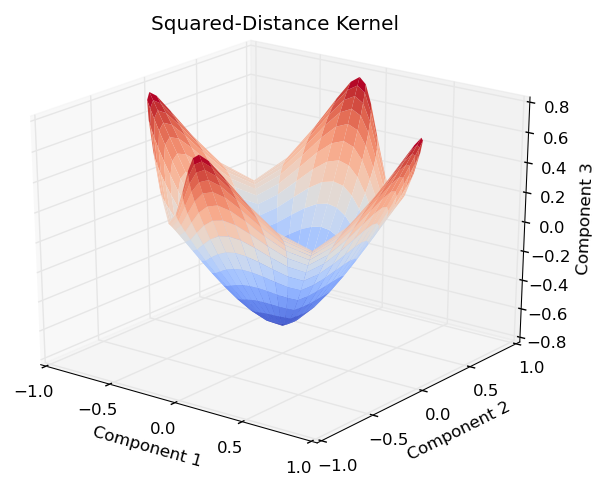
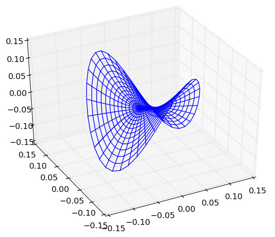
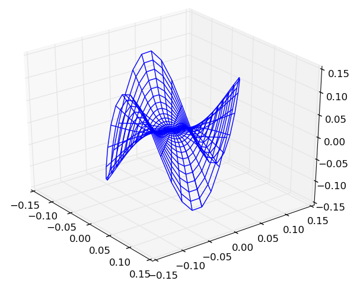

----------------
Kernel Functions
----------------

A number of popular kernels have been pre-defined for ease of use. Below is a
summary table for quick reference:

=================== ================================== ======= =================
Kernel              Constructor                        Mercer  Negative Definite
=================== ================================== ======= =================
:ref:`kern-scprod`  ``ScalarProductKernel()``          ✓       ✗
:ref:`kern-sqdist`  ``SquaredDistanceKernel(t)``       ✗       ✓
:ref:`kern-sinsq`   ``SineSquaredKernel(p,t)``         ✗       ✓
:ref:`kern-chisq`   ``ChiSquaredKernel(t)``            ✗       ✓
:ref:`kern-gauss`   ``GaussianKernel(α)``              ✓       ✗
:ref:`kern-lapla`   ``LaplacianKernel(α)``             ✓       ✗
:ref:`kern-period`  ``PeriodicKernel(α,p)``            ✓       ✗
:ref:`kern-ratquad` ``RationalQuadraticKernel(α,β,γ)`` ✓       ✗
:ref:`kern-matern`  ``MaternKernel(ν,θ)``              ✓       ✗
:ref:`kern-poly`    ``PolynomialKernel(a,c,d)``        ✓       ✗
:ref:`kern-sigmoid` ``SigmoidKernel(α,c)``             ✗       ✗
=================== ================================== ======= =================

.. _kern-scprod:

Scalar Product Kernel
.....................

.. code-block:: julia

    ScalarProductKernel()           # Construct 64 bit kernel (default)
    ScalarProductKernel{Float32}()  # Construct 32 bit kernel

The scalar product kernel, or linear kernel, is the dot product of two vectors:

.. math::
    
    \kappa(\mathbf{x},\mathbf{y}) = \mathbf{x}^{\intercal} \mathbf{y}

The scalar product is a **Mercer** kernel [berg]_. This kernel is provided 
primarily for constructing new kernels (ex. polynomial kernel) since usage of 
this kernel in a kernel-based algorithm will often be equivalent to the 
non-kernelized version of the algorithm. For example, kernel principal 
components analysis with a scalar product kernel is equivalent to normal 
principal components analysis.

.. _kern-sqdist:

Squared Distance Kernel
.......................

.. code-block:: julia

    SquaredDistanceKernel(t=1)

The squared distance kernel is a modification of the squared Euclidean distance
with an additional shape parameter:

.. math::
    
    \kappa(\mathbf{x},\mathbf{y}) = \sum_{i=1}^n (x_i - y_i)^{2t} \qquad 0 < t \leq 1

The squared distance is a **negative definite** stationary kernel [berg]_. The 
first three components of kernel PCA over an ellipse in :math:`\mathbb{R}^2`
with a squared distance kernel (:math:`t=0.5`) are visualized below:

.. _kern-sinsq:

Sine Squared Kernel
...................

.. code-block:: julia

  SineSquaredKernel(p=π,t=1)

The sine squared kernel is another **negative definite** stationary kernel
[berg]_. It can be used to construct the periodic kernel which is useful in
situations where data may be periodic:

.. math::
    
    \kappa(\mathbf{x},\mathbf{y}) = \sum_{i=1}^n \sin^{2t}(p(x_i - y_i)) \qquad p >0, \;0 < t \leq 1

The first three components of kernel PCA over an ellipse in :math:`\mathbb{R}^2`
with a sine squared kernel (:math:`p=1`, :math:`t=1`) are visualized below:

.. image:: images/kernels/sine-squared_kernel.png
    :alt: The first three components of KPCA with a sine-squared kernel.

Over a larger range, the projected surface can be seen to fold in on itself and
repeat the shape.

.. _kern-chisq:

Chi-Squared Kernel
..................

.. code-block:: julia
  
  ChiSquaredKernel(t=1)

The chi-squared kernel is a **negative definite** most often used with 
bag-of-words models:

.. math::
    
    \kappa(\mathbf{x},\mathbf{y}) = \sum_{i=1}^n \left(\frac{(x_i - y_i)^2}{x_i + y_i}\right)^t \qquad 0 < t \leq 1, \; x_i > 0 \; \forall i, \; y_i > 0 \; \forall i

The first three components of kernel PCA over an ellipse in :math:`\mathbb{R}^2`
with a chi-squared kernel (:math:`t=1`) are visualized below:

.. image:: images/kernels/chi-squared_kernel.png
    :alt: The first three components of KPCA with a chi-squared kernel.

    
.. _kern-gauss:

Gaussian Kernel
...............

.. code-block:: julia

  GaussianKernel(α=1)
  RadialBasisKernel(α=1)
  SquaredExponentialKernel(α=1)

The Gaussian kernel is an isotropic Mercer kernel given by:

.. math::

    k(\mathbf{x},\mathbf{y}) = \exp\left(-\alpha ||\mathbf{x} - \mathbf{y}||^2\right) \qquad \alpha > 0

where :math:`\alpha` is a scaling parameter of the squared distance. The 
Gaussian kernel often goes by two other names: the radial basis kernel and the 
squared exponential covariance function (Gaussian processes). The first three 
components of kernel PCA over an ellipse in :math:`\mathbb{R}^2` with a 
Gaussian kernel are visualized below:

.. image:: images/kernels/gaussian_kernel.png
    :alt: The first three components of KPCA with a Gaussian Kernel.

.. _kern-lapla:

Laplacian Kernel
................

.. code-block:: julia

  LaplacianKernel(α=1)

The Laplacian kernel is given by:

.. math::

    k(\mathbf{x},\mathbf{y}) = \exp\left(-\alpha ||\mathbf{x} - \mathbf{y}||\right) \qquad \alpha > 0

where :math:`\alpha` is a scaling parameter of the Euclidean distance. The 
Laplacian kernel is closely related to the Gaussian kernel; the difference is 
that the Laplacian kernel makes use of the Euclidean distance and the Gaussian 
kernel uses the squared Euclidean distance. The first three components of kernel
PCA over an ellipse in :math:`\mathbb{R}^2` with a Laplacian kernel 
(:math:`t=1`) for a similar surface to a Gaussian kernel:

.. image:: images/kernels/laplacian_kernel.png
    :alt: The first three components of KPCA with a Laplacian Kernel.

.. _kern-period:

Periodic Kernel
...............

.. code-block:: julia

  PeriodicKernel(α=1,p=π)

The periodic kernel is given by:

.. math::

    k(\mathbf{x},\mathbf{y}) = \exp\left(-\alpha \sum_{i=1}^n \sin(p(x_i - y_i))^2\right) \qquad p >0, \; \alpha > 0

where :math:`\mathbf{x}` and :math:`\mathbf{y}` are :math:`n` dimensional 
vectors. The parameters :math:`p` and :math:`\alpha` are scaling parameters for
the periodicity and the magnitude, respectively. This kernel is useful when data
has periodicity to it. The first three components of kernel PCA over an ellipse 
in :math:`\mathbb{R}^2` with a periodic kernel (:math:`\alpha=1`, :math:`p=\pi`) 
are visualized below:

.. image:: images/kernels/periodic_kernel.png
    :alt: The first three components of KPCA with a Periodic Kernel.

.. _kern-ratquad:

Rational-Quadratic Kernel
.........................

.. code-block:: julia

  RationalQuadraticKernel(α=1,β=1,γ=1)

The rational-quadratic kernel is given by:

.. math::

    k(\mathbf{x},\mathbf{y}) = \left(1 +\alpha ||\mathbf{x},\mathbf{y}||^2\right)^{-\beta} \qquad \alpha > 0, \; \beta > 0

where :math:`\alpha` is a scaling parameter and :math:`\beta` is a shape
parameter. This kernel can be seen as an infinite sum of Gaussian kernels. If
one sets :math:`\alpha = \alpha_0 / \beta`, then taking the limit :math:`\beta
\rightarrow \infty` results in the Gaussian kernel with scaling parameter
:math:`\alpha_0`. The first three components of kernel PCA over an ellipse 
in :math:`\mathbb{R}^2` with a rational-quadratic kernel (:math:`\alpha=1`, 
:math:`\beta=1`, :math:`\gamma=1`) are visualized below:

.. image:: images/kernels/rational-quadratic_kernel.png
    :alt: The first three components of KPCA with a Rational-Quadratic Kernel.
    

.. _kern-matern:

Matern Kernel
.............

.. code-block:: julia

  MaternKernel(ν=1,θ=1)
  MatérnKernel(ν=1,θ=1)

The Matern kernel is a **Mercer** Kernel [ras]_ given by:

.. math::

    k(\mathbf{x},\mathbf{y}) = \frac{1}{2^{\nu-1}\Gamma(\nu)} \left(\frac{2\sqrt{\nu}||\mathbf{x}-\mathbf{y}||}{\theta}\right)^{\nu} K_{\nu}\left(\frac{2\sqrt{\nu}||\mathbf{x}-\mathbf{y}||}{\theta}\right)

where math:`\Gamma` is the gamma function, :math:`K_{\nu}` is the modified 
Bessel function of the second kind, :math:`\nu > 0` and :math:`\theta > 0`. The 
first three components of kernel PCA over an ellipse in :math:`\mathbb{R}^2` 
with a Matern kernel (:math:`\nu=1`, :math:`\theta=1`) are visualized below:

.. image:: images/kernels/matern_kernel.png
    :alt: The first three components of KPCA with a Matern Kernel.

.. _kern-poly:

Linear & Polynomial Kernel
..........................

.. code-block:: julia

  LinearKernel(a=1,c=1)
  PolynomialKernel(a=1,c=1,d=3)

The polynomial kernel is a **Mercer** kernel given by:

.. math::

    k(\mathbf{x},\mathbf{y}) = (\alpha \mathbf{x}^\intercal \mathbf{y} + c)^d \qquad \alpha > 0, \; c \geq 0, \; d \in \mathbb{Z}_{+}

The first three components of kernel PCA over an ellipse in :math:`\mathbb{R}^2` 
with a polynomial kernel (:math:`a=1`, :math:`c=1`, :math:`d=3`) are visualized 
below:

.. _kern-sigmoid:

Sigmoid Kernel
..............

.. code-block:: julia

  SigmoidKernel(a=1,c=1)

The sigmoid kernel is given by:

.. math::

    k(\mathbf{x},\mathbf{y}) = \tanh(\alpha \mathbf{x}^\intercal \mathbf{y} + c) \qquad \alpha > 0, \; c \geq 0

The sigmoid kernel is a not a true kernel, although it has been used in 
application. The first three components of kernel PCA over an ellipse in 
:math:`\mathbb{R}^2` with a sigmoid kernel (:math:`a=1`, :math:`c=1`) are 
visualized below:

