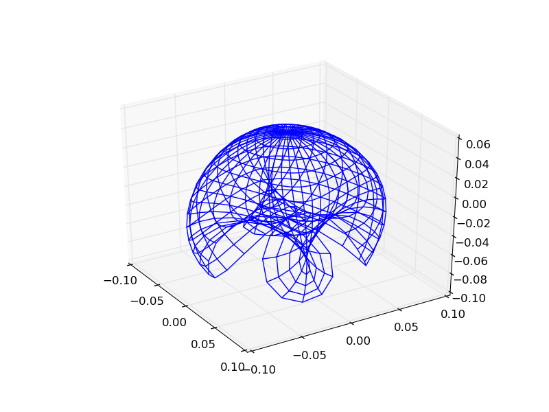
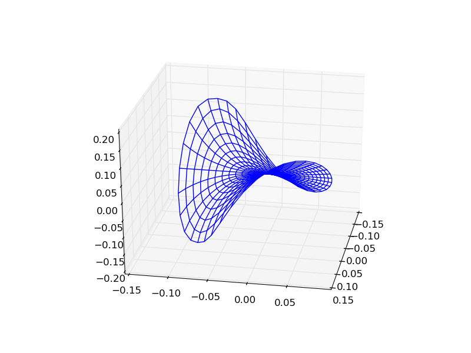
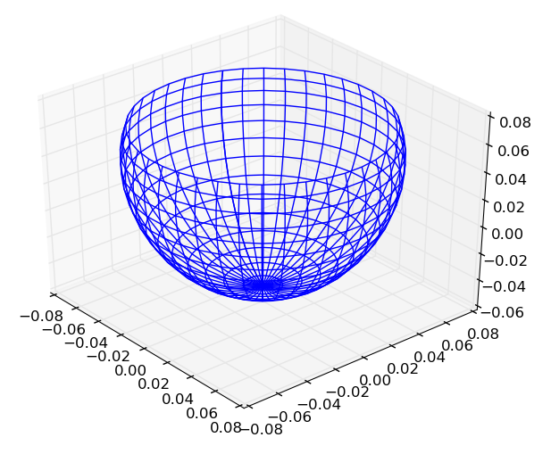
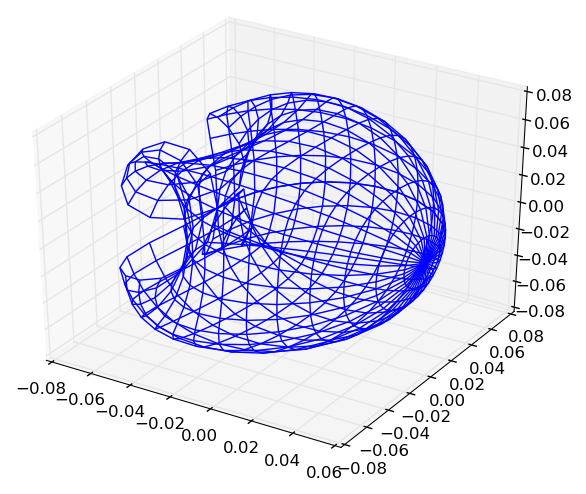
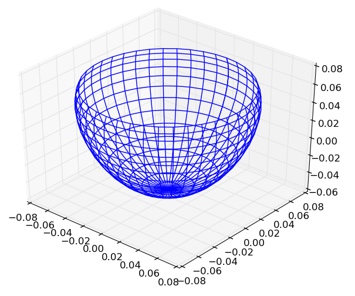

-------
Kernels
-------

+---------------------+--------+-------------------+
| Kernel              | Mercer | Negative Definite |
+=====================+========+===================+
| :ref:`kern-scprod`  | ✓      | ✗                 |
+---------------------+--------+-------------------+
| :ref:`kern-sqdist`  | ✗      | ✓                 |
+---------------------+--------+-------------------+
| :ref:`kern-sinsq`   | ✗      | ✓                 |
+---------------------+--------+-------------------+
| :ref:`kern-chisq`   | ✗      | ✓                 |
+---------------------+--------+-------------------+
| :ref:`kern-gauss`   | ✓      | ✗                 |
+---------------------+--------+-------------------+
| :ref:`kern-lapla`   | ✓      | ✗                 |
+---------------------+--------+-------------------+
| :ref:`kern-period`  | ✓      | ✗                 |
+---------------------+--------+-------------------+
| :ref:`kern-ratquad` | ✓      | ✗                 |
+---------------------+--------+-------------------+
| :ref:`kern-matern`  | ✓      | ✗                 |
+---------------------+--------+-------------------+
| :ref:`kern-poly`    | ✓      | ✗                 |
+---------------------+--------+-------------------+
| :ref:`kern-sigmoid` | ✗      | ✗                 |
+---------------------+--------+-------------------+

.. _kern-scprod:

Scalar Product Kernel
.....................

The scalar product kernel is the dot product of two vectors:

.. math::
    
    \kappa(\mathbf{x},\mathbf{y}) = \mathbf{x}^{\intercal} \mathbf{y}

The scalar product is a Mercer kernel [berg]_ - it can be used to construct 
kernels such as the Polynomial Kernel. The kernel may be constructed using:

.. code-block:: julia

    ScalarProductKernel()           # Construct 64 bit kernel (default)
    ScalarProductKernel{Float32}()  # Construct 32 bit kernel

.. _kern-sqdist:

Squared Distance Kernel
.......................

The squared distance kernel is a modification of the squared Euclidean distance
with an additional shape parameter:

.. math::
    
    \kappa(\mathbf{x},\mathbf{y}) = \sum_{i=1}^n (x_i - y_i)^{2t} \qquad 0 < t \leq 1

The squared distance is a **negative definite** stationary kernel [berg]_. The 
Gaussian kernel is a scalar transformation of this kernel. The kernel may be
constructed using:

.. code-block:: julia

    SquaredDistanceKernel()   # Squared distance kernel with t = 1.0
    SquaredDistanceKernel(t)  # Squared distance kernel specified t value

.. _kern-sinsq:

Sine Squared Kernel
...................
    
The sine squared kernel is another **negative definite** stationary kernel
[berg]_. It can be used to construct the periodic kernel which is useful in
situations where data may be periodic:

.. math::
    
    \kappa(\mathbf{x},\mathbf{y}) = \sum_{i=1}^n \sin^{2t}(p(x_i - y_i)) \qquad p >0, \;0 < t \leq 1

A sine squared kernel may be constructed using:

.. code-block:: julia

    SineSquaredKernel()     # Sine Squared kernel with p = π, t = 1.0
    SineSquaredKernel(p,t)  # Sine Squared kernel specified p & t values

The first three components of KPCA with a sine squared kernel:

Over a larger range, the projected surface can be seen to fold in on itself and
repeat the shape.

.. _kern-chisq:

Chi-Squared Kernel
..................

The Chi-Squared kernel is a **negative definite** most often used with 
bag-of-words models:

.. math::
    
    \kappa(\mathbf{x},\mathbf{y}) = \sum_{i=1}^n \left(\frac{(x_i - y_i)^2}{x_i + y_i}\right)^t \qquad 0 < t \leq 1, \; x_i > 0 \; \forall i, \; y_i > 0 \; \forall i

The Chi-Squared kernel may be constructed using:

.. code-block:: julia

    ChiSquaredKernel()   # Sine Squared kernel with t = 1.0
    ChiSquaredKernel(t)  # Sine Squared kernel specified t value

The first three components of KPCA with a Chi-Squared kernel:

    
.. _kern-gauss:

Gaussian Kernel
...............

The Gaussian kernel is given by:

.. math::

    k(\mathbf{x},\mathbf{y}) = \exp\left(-\alpha ||\mathbf{x} - \mathbf{y}||^2\right) \qquad \alpha > 0

where :math:`a` is a scaling parameter of the squared distance. The Gaussian
kernel often goes by two other names - the radial basis Kernel and the squared
exponential Kernel (Gaussian processes).

.. code-block:: julia

    GaussianKernel{T<:AbstractFloat}(α::T = 1.0)
    RadialBasisKernel{T<:AbstractFloat}(α::T = 1.0)
    SquaredExponentialKernel{T<:AbstractFloat}(α::T = 1.0)

The first three components of KPCA with a Gaussian Kernel:

.. _kern-lapla:

Laplacian Kernel
................

The Laplacian kernel is given by:

.. math::

    k(\mathbf{x},\mathbf{y}) = \exp\left(-\alpha ||\mathbf{x} - \mathbf{y}||\right) \qquad \alpha > 0

where :math:`a` is a scaling parameter of the Euclidean distance. The Laplacian
kernel is closely related to the Gaussian kernel; the difference is that the
Laplacian kernel makes use of the Euclidean distance and the Gaussian kernel
uses the squared Euclidean distance.

.. code-block:: julia

    LaplacianKernel{T<:AbstractFloat}(α::T = 1.0)

The first three components of KPCA with a Laplacian Kernel result in a very
similar shape to KPCA with a Gaussian Kernel:

.. image:: images/kernels/laplacian_kernel.png
    :alt: The first three components of KPCA with a Laplacian Kernel.

.. _kern-period:

Periodic Kernel
...............

The periodic kernel is given by:

.. math::

    k(\mathbf{x},\mathbf{y}) = \exp\left(-\alpha \sum_{i=1}^n \sin(p(x_i - y_i))^2\right) \qquad p >0, \; \alpha > 0

where :math:`\mathbf{x}` and :math:`\mathbf{y}` are :math:`n` dimensional 
vectors. The parameters :math:`p` and :math:`\alpha` are scaling parameters for
the periodicity and the magnitude, respectively. This kernel is useful when data
has periodicity to it.

.. code-block:: julia

    PeriodicKernel{T<:AbstractFloat}(α::T = 1.0, p::T = convert(T, π))

The first three components of KPCA with a Periodic Kernel:

.. _kern-ratquad:

Rational-Quadratic Kernel
.........................

.. function:: RationalQuadraticKernel{T}(α::T = 1.0, β::T = one(T), γ::T = one(T))

The rational-quadratic kernel is given by:

.. math::

    k(\mathbf{x},\mathbf{y}) = \left(1 +\alpha ||\mathbf{x},\mathbf{y}||^2\right)^{-\beta} \qquad \alpha > 0, \; \beta > 0

where :math:`\alpha` is a scaling parameter and :math:`\beta` is a shape
parameter. This kernel can be seen as an infinite sum of Gaussian kernels. If
one sets :math:`\alpha = \alpha_0 / \beta`, then taking the limit :math:`\beta
\rightarrow \infty` results in the Gaussian kernel with scaling parameter
:math:`\alpha_0`. 

.. code-block:: julia

    RationalQuadraticKernel{T<:AbstractFloat}(α::T = 1.0, β::T = one(T), γ::T = one(T))

The first three components of KPCA with a Rational-Quadratic Kernel:

    
.. _kern-matern:

Matern Kernel
.............

The Matern kernel is given by:

.. math::

    k(\mathbf{x},\mathbf{y}) = \frac{1}{2^{\nu-1}\Gamma(\nu)} \left(\frac{2\sqrt{\nu}||\mathbf{x}-\mathbf{y}||}{\theta}\right)^{\nu} K_{\nu}\left(\frac{2\sqrt{\nu}||\mathbf{x}-\mathbf{y}||}{\theta}\right)

where :math:`\kappa` is a non-negative negative definite kernel, :math:`\Gamma` is the gamma
function, :math:`K_{\nu}` is the modified Bessel function of the second kind, :math:`\nu > 0`
and :math:`\theta > 0`. The Matern kernel is a Mercer kernel. 

.. code-block:: julia

    MaternKernel{T<:AbstractFloat}(ν::T = 1.0, θ::T = one(T))
    MatérnKernel{T<:AbstractFloat}(ν::T = 1.0, θ::T = one(T))

.. _kern-poly:

Linear & Polynomial Kernel
..........................

The polynomial kernel is given by:

.. math::

    k(\mathbf{x},\mathbf{y}) = (\alpha\kappa(\mathbf{x},\mathbf{y}) + c)^d \qquad \alpha > 0, \; c \geq 0, \; d \in \mathbb{Z}_{+}

where :math:`\kappa` is a Mercer kernel. The polynomial kernel is a Mercer kernel.

.. code-block:: julia

    LinearKernel{T<:AbstractFloat}(a::T = 1.0, c = one(T))
    PolynomialKernel{T<:AbstractFloat}(a::T = 1.0, c = one(T), d = 3one(T))

.. _kern-sigmoid:

Sigmoid Kernel
..............

Construct a sigmoid kernel:

.. math::

    k(\mathbf{x},\mathbf{y}) = \tanh(\alpha\kappa(\mathbf{x},\mathbf{y}) + c) \qquad \alpha > 0, \; c \geq 0

where :math:`\kappa` is a Mercer kernel. The sigmoid kernel is a not a true kernel, although
it has been used in application.
